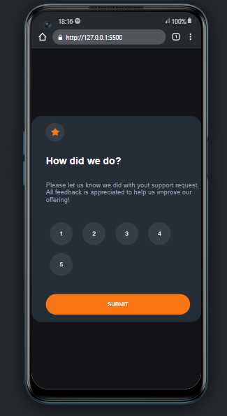
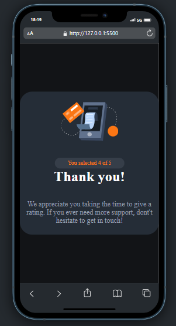
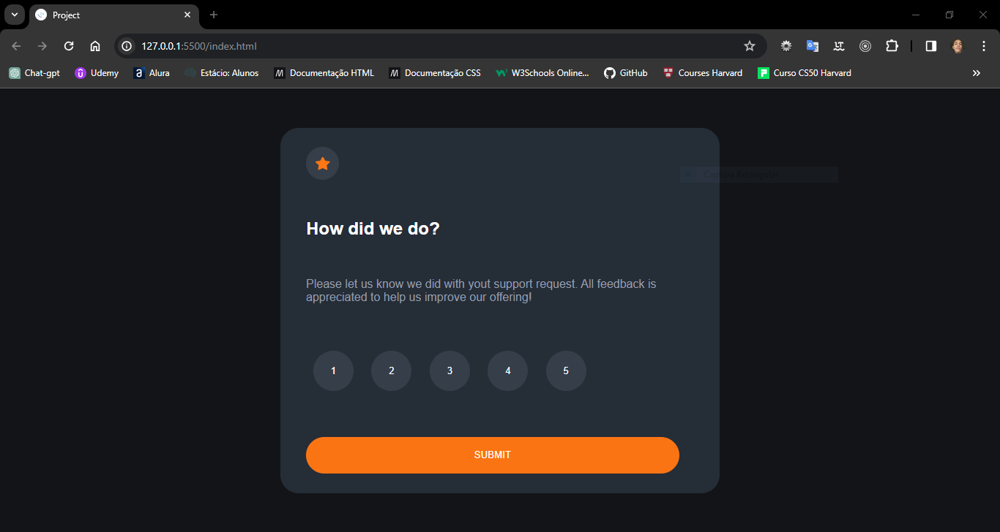

# Desafio-Frontend-Mentor-pagina-de-avaliacao
[](https://github.com/GuilhermeHenrii/Desafio_Frontend_Mentor/blob/main/LICENSE)
# Sobre o projeto

Esse projeto tem como objetivo simular uma página de avaliação de um atendimento. O usuário pode escolher uma nota e será redirecionado para uma página de agradecimento de acordo com a nota escolhida.

## Layout mobile



## Layout web


# Tecnologias utilizadas

- HTML / CSS / JS

# Como executar o projeto

Pré-requisitos: VScode, Live Server

```bash
# clonar repositório
git clone https://github.com/GuilhermeHenrii/Desafio_Frontend_Mentor.git

# entrar na pasta do projeto front end web
cd desafio_frontend_mentor

# executar o projeto
// Inicialize o Live Server a partir do arquivo HTML raiz da página
```

# Autor

Guilherme Henrique da Silva Lopes

https://www.linkedin.com/in/guilherme-henrique-7aab6b229/
